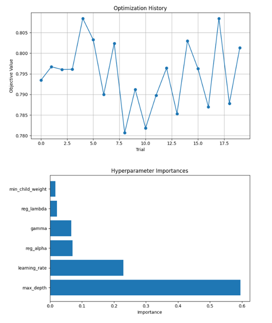

# Loan Default Prediction 

## NON-TECHNICAL EXPLANATION

The project is about loans defaults identification and prediction. When a person applies for a loan, banks have to figure out whether that person is likely to pay the loan back or not. Using data like income, credit score, employment type, and other financial indicators, I built a model that predicts whether someone might default on their loan or not. 

This kind of tool can help financial institutions reduce risk and offer fairer loans to more people. Loan defaults can lead to major financial losses for a company. The project looks at data from past loans to spot patterns and build a system that can predict which loans are likely to default. This helps lenders avoid adverse loans and identify trustworthy borrowers who might otherwise be overlooked.

By analyzing the data, I trained a machine learning model that can predict whether a loan applicant will default or not. The idea is to reduce risk while making lending more efficient and inclusive.

## DATA

The loan_default_dataset.csv was created by Coursera as part of the course Data Science Coding Challenge: Loan Default Prediction. I access the public domain data published in 20223 in Kaggle.

The data was created to develop ML models to tackle one relevant financial problem that concers the majority of the financial institutions, loans defaults. One of the primary objectives of companies with financial loan services is to reduced payment defaults and ensure that individuals are paying back their loans as expected. Having a considerable large data set can help ML developments to decide what models is the best fit for it. 

It corresponds to a synthetic dataset built to simulate real-world credit risk scenarios. The dataset contains 255,347 rows and 18 columns in total.

## MODEL 

For this project, I first used several machine learning models to predict whether a loan will default, in particular:

*   Decision Tree Classifier
*   Logistic Regression
*   Random Forest Classifier
*   XGBoost Classifier

Each of these models is suited for classification tasks like loan default prediction because they can handle both numerical and categorical data, and are interpretable.
After comparing model performance, I chose to focus on Logistic Regression and Decision tree due to their higher accuracy and recall trade off. 

LogisticRegression( random_state=42, class_weight='balanced')

Key Characteristics:
Binary Classification: Logistic Regression is used when the output is categorical with two possible outcomes, 'Default' and 'No Default'.
Sigmoid Function: The model uses the sigmoid (logistic) function to map predicted values to probabilities between 0 and 1.
Interpretability: The coefficients of the logistic regression model indicate the importance and effect of each feature on the outcome.

## HYPERPARAMETER OPTIMSATION

Before deciding what model to use, I tuned the hyperparameters of each using Bayesian Optimization. I started first with BayesSearchCV/GridSearchCV. However, for some of the models it took too long to run and became inefficient. Therefore, I decided to try hyperparameters tunning using Optuna, a hyperparameter optimization framework that is fast, flexible, and integrates with scikit-learn and PyTorch.

I define the objective function with the specific parameters of each model, create the model and used cross-validation with recall measure as a driver. First, I tried to  maximize the accuracy, but then switch it to recall as a scoring = ‘recall’, considering that it was more important to answer; of all loans that actually defaulted, how many did the model catch? Recall = true positives / (true positives + false negatives)

For example: score = cross_val_score(xgb_clf, X_train_resampled, y_train_resampled, cv=3, scoring = 'recall').mean()

After each fold, it measures how much of the actual defaults your model correctly caught (). Since the important part here was to identify as many defaults as we could. 

Afterwards, I run the optimization and fit each model with the best parameters. For example the below charts show the optimization performance of the XGBoos Classifier. It shows the result of each trian and the hyperparameters importance. 

## RESULTS

The best-performing models were then evaluated using:

* Accuracy
* Precision
* Recall
* ROC AUC Score

This approach ensured that the final model was not only accurate but also well-balanced in identifying defaults, which is critical in high-risk financial decisions.

Logistic Regression Model Results:

