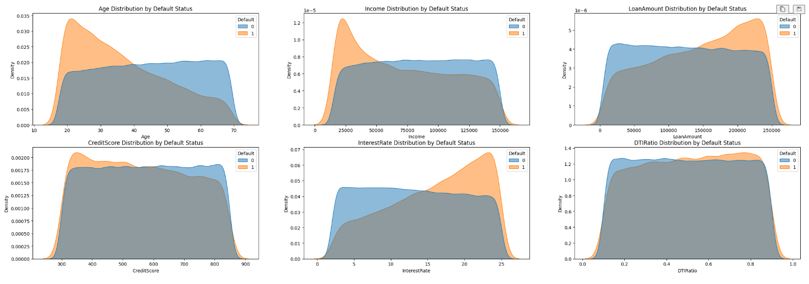

# Model Card

## Model Description

**Input:** 

The loan_default_dataset.csv was created by Coursera as part of the course Data Science Coding Challenge: Loan Default Prediction. I access the public domain data published in 20223 in Kaggle.
I used the train_test_split(X, y, shuffle=True , test_size=0.2, random_state=42)
Analysing the categorical variables, we can conclude that the data is well distributed:

**Output:** 

**Model Architecture:** 
## Performance

In order to decide what model was the best to predict loan defaults, I use:
* Random Forest
* k-Nearest Neighbors (KNN)
* Logistic Regression
* XGBoost Classifier

Before deciding what model to use, I tuned the hyperparameters of each using Bayesian Optimization. I started using BayesSearchCV/GridSearchCV. However, for some of the models it took too long to run and became inefficient. Therefore, I decided to try hyperparameters tunning using Optuna, a hyperparameter optimization framework that’s fast, flexible, and integrates with scikit-learn and PyTorch.

I define the objective function with the parameters of each model, create the model and used cross-validation with recall measure as a driver. After each fold, it measures how much of the actual defaults your model correctly caught (recall = true positives / (true positives + false negatives)). Since the important part here was to identify as many defaults as we could. 

Afterwards, I run the optimization and fit each model with the best parameters. 

The results were the following for each model:

Comparative table

ROC Curve

Precision-Recall Curve

Conclusions:
*   Decision Tree: It has the highest capacity to identify true positives (with a recall of 81%). However, it wrongly marks a lot of good loans as defaulters with a low precision value of 15%. It seems to be an option if we only want to identify the default at all cost, but not ideal.
*   k-Nearest Neighbours (KNN): Very poor performance overall. Low accuracy and low recall as well as precision. Lowest ROC AUC (53%)
*   Logistic Regression: Evidence solid performance with a good balance between Precision and Recall. It has acceptable values for accuracy and the highest ROC. It stands out as a very solid baseline model.
*   Random Forest: We can see that it has the second highest accuracy value (77%) but a very low recall of 39%, among the worse models based on this measure what means that it will miss many defaults. This implies that the model may struggle to identify true positives defaults.
*   XGBoost Classifier: It presents the highest Accuracy (81%) and best Precision (26%). However, it shows a poor Recall (33%) missing many defaulted loans. Despite this limitation, the highest precision of 25% indicates that it works well identifying positive cases when making predictions.

As a conclusion, I would use for my loans default prediction, **Logistic Regression** and in second place would be **Decision Tree**. 

## Limitations

The results of my analysis showed that there were imbalanced classes. This can cause the model to: be biased toward the majority class (No Default), fail to detect important rare events and show misleading metrics like high accuracy, even if it's not learning anything useful.

Distribution of classes y_train:

Non-Default 0.883722
Default 0.116278

Distribution of classes y_test:

Non-Default: 0.884472
Default: 0.115528

Therefore, I focused on the relevant features decided via Random Forest and then resample the data based on this importance.  

Applying Synthetic Minority Over-Sampling Technique (SMOTE) balanced the classes on the training set only and reaching a 50% for default/no default.

However, even with resampling, the model might overfit to synthetic or duplicated examples.
Additionally, although I based my decision on precision-recall trade-off, high recall means more false positives, which could impact good borrowers.
I don’t think the model can lead to bias based on how well distributed was the data on the categorical variables. However, the model was trained on historical data, which may not fully represent future economic conditions like recessions.

## Trade-offs

When picking Logistic Regression as my model, I am resigning Precision for high levels of Recall and Accuracy. 
